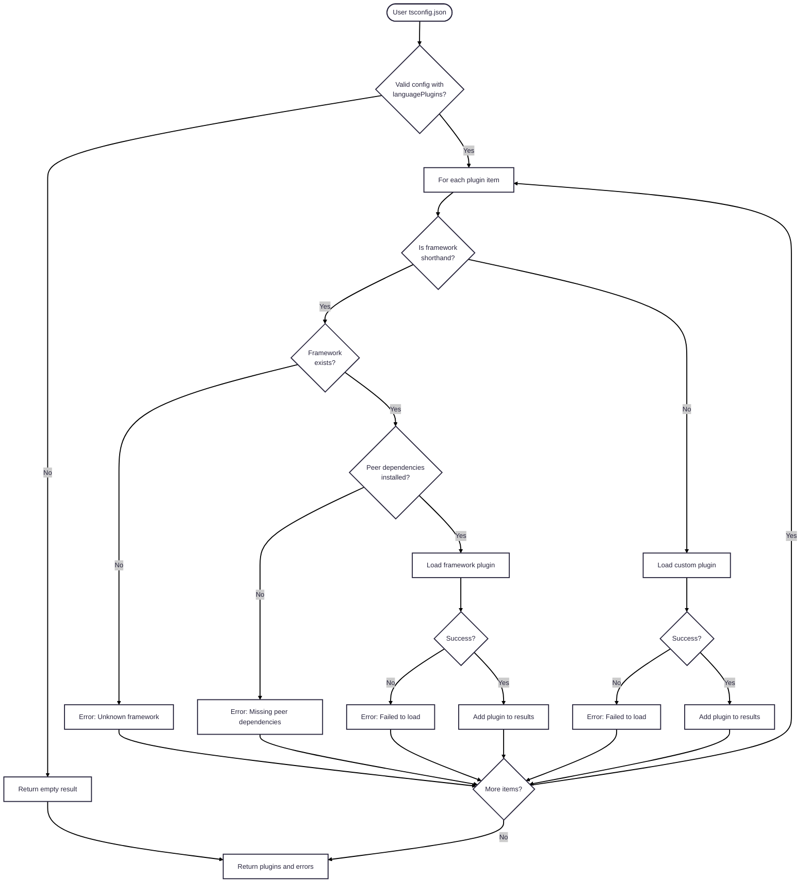

# Language Plugin Resolution Architecture

## Overview

The language plugin resolution system supports both **framework shorthands**
(e.g., `"vue"`, `"svelte"`) and **custom module specifiers**
(e.g., `"@my-org/my-plugin"`).

## Module Structure (`lib/language-plugins`)

The resolution logic is split into focused, single-responsibility modules:

### `registry.js`

**Responsibility**: Framework registry and lookup

* Maintains `FRAMEWORK_PLUGINS` mapping of framework shorthands to plugin
  specifiers
* Provides functions to check if a name is a framework shorthand
* Returns framework configuration including peer dependencies

**Exports**:

* `FRAMEWORK_PLUGINS` - Registry of known frameworks
* `isFrameworkShorthand(name)` - Check if name is a known framework
* `getFrameworkConfig(name)` - Get framework configuration
* `getSupportedFrameworks()` - Get list of all framework names

### `validator.js`

**Responsibility**: Plugin and dependency validation

* Validates that a loaded module conforms to Volar’s `LanguagePlugin` interface
* Checks if peer dependencies are installed
* Returns lists of missing peer dependencies

**Exports**:

* `isValidLanguagePlugin(plugin)` - Validate plugin interface
* `isPeerDependencyInstalled(packageName, resolvePlugin)` -
  Check single dependency
* `getMissingPeerDependencies(peerDependencies, resolvePlugin)` -
  Check multiple dependencies

### `loader.js`

**Responsibility**: Low-level plugin loading

* Loads a module by specifier
* Calls `getLanguagePlugin()` to get the plugin instance
* Validates the plugin conforms to the interface (skipped for our own plugins)
* Returns structured result with plugin or error

**Exports**:

* `loadLanguagePlugin(moduleSpecifier, resolvePlugin)` -
  Load and validate a plugin

### `resolver.js`

**Responsibility**: High-level resolution orchestration

* Coordinates the resolution process
* Determines if input is a framework shorthand or custom specifier
* Delegates to appropriate resolution functions
* Aggregates results and errors

**Exports**:

* `resolveLanguagePlugins(mdxConfig, resolvePlugin)` - Main entry point
* Types: `LanguagePluginLoadError`, `ResolveLanguagePluginsResult`

### `tsconfig.js`

**Responsibility**: Public API surface

* Re-exports `resolveLanguagePlugins` for backward compatibility
* Contains remark plugin resolution (separate concern)

## Resolution Flow



### Detailed Sequence

For those who need the full details:

## Design Principles

1. **Single Responsibility**: Each module has one clear purpose
2. **Separation of Concerns**: Registry, validation, loading, and resolution
   are separate
3. **Composability**: Functions are small and compose together
4. **Testability**: Each module can be tested independently
5. **Error Handling**: Structured errors with type discrimination
6. **Extensibility**: Easy to add new frameworks or validation rules

## Adding a New Framework

To add support for a new framework shorthand:

1. Add entry to `FRAMEWORK_PLUGINS` in `language-plugins/registry.js`:

   ```js
   newframework: {
     plugin: '@org/package/export',
     peerDependencies: ['peer-dep-1', 'peer-dep-2']
   }
   ```

2. No other changes needed - the system automatically:

   * Validates peer dependencies
   * Provides helpful error messages
   * Loads the plugin (validation skipped for our own plugins)

## Custom Module Specifiers

Users can provide any module specifier.
The system will:

1. Attempt to resolve the module
2. Check for `getLanguagePlugin()` function export
3. Validate the returned plugin interface
4. Report structured errors if any step fails

No peer dependency validation is performed for custom specifiers.
